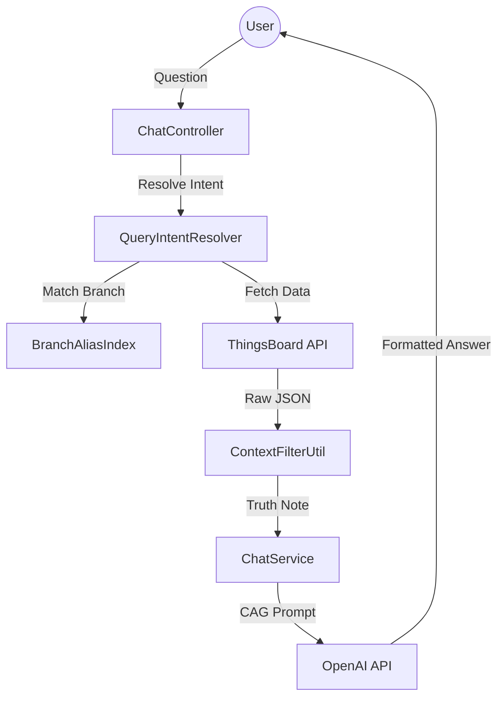

# 🛒 E-Commerce Platform

A full-stack e-commerce application built with Spring Boot (Backend) and React (Frontend). This platform supports three user roles: **User**, **Seller**, and **Admin**, with features for product browsing, shopping cart, orders, payments, and seller management.

---

## 📋 Table of Contents

- [Features](#features)
- [Tech Stack](#tech-stack)
- [Project Structure](#project-structure)
- [Setup & Installation](#setup--installation)
- [Environment Variables](#environment-variables)

---

## ✨ Features

### 👤 User
- Browse products by category
- View product details with images, ratings, and reviews
- Add products to shopping cart
- Place orders with delivery address
- Make payments
- View order history and track status
- Search products
- Rate and review products

### 🏪 Seller
- Multi-step registration process
- Add, update, and delete products
- Manage product inventory
- View orders for their products
- Track sales and revenue
- Access customer insights
- View reports and analytics

### 👑 Admin
- Manage all users and sellers
- Approve or block sellers
- Manage all products and categories
- Monitor orders and transactions
- Platform-wide analytics

---

## 🧱 Tech Stack

### Backend
| Technology | Purpose |
|------------|---------|
| Spring Boot 3.4.3 | Application framework |
| Spring Data JPA | ORM and data access |
| Spring Security | Authentication & authorization |
| PostgreSQL / MySQL | Database |
| JWT (JSON Web Tokens) | Stateless authentication |
| Lombok | Boilerplate code reduction |
| ModelMapper | Object mapping |
| Maven | Build tool |

### Frontend
| Technology | Purpose |
|------------|---------|
| React 19 | UI library |
| Vite | Build tool |
| Redux Toolkit | State management |
| React Router DOM | Client-side routing |
| Tailwind CSS 4 | Utility-first styling |
| Material UI (MUI) | Component library |
| Axios | HTTP client |
| React Hot Toast | Notifications |

---

## 📁 Project Structure

```
Ecommerce-Web/
├── ecom-backend/
│   ├── src/main/java/com/ecommerce/project/
│   │   ├── config/              # Security & app configuration
│   │   ├── controller/          # REST API controllers
│   │   ├── exception/           # Custom exceptions & handlers
│   │   ├── model/              # JPA entities
│   │   ├── payload/            # Request/Response DTOs
│   │   ├── repository/         # Data access interfaces
│   │   ├── security/           # JWT, Auth filters, Config
│   │   ├── service/            # Business logic
│   │   └── util/               # Utility classes
│   └── pom.xml                 # Maven dependencies
│
├── ecom-frontend/
│   ├── src/
│   │   ├── api/                # Axios configuration
│   │   ├── auth/               # Seller registration pages
│   │   ├── components/         # Reusable UI components
│   │   │   ├── layout/         # Layout components
│   │   │   ├── Footer.jsx
│   │   │   ├── Navbar.jsx
│   │   │   ├── ProductCard.jsx
│   │   │   └── CategoryCard.jsx
│   │   ├── pages/
│   │   │   ├── user/           # Customer-facing pages
│   │   │   │   ├── Home.jsx
│   │   │   │   ├── Categories.jsx
│   │   │   │   └── Search.jsx
│   │   │   └── seller/         # Seller dashboard pages
│   │   │       ├── Dashboard.jsx
│   │   │       ├── Inventory.jsx
│   │   │       ├── Orders.jsx
│   │   │       ├── Customers.jsx
│   │   │       └── Reports.jsx
│   │   ├── routes/             # Route definitions
│   │   ├── store/              # Redux state management
│   │   │   ├── actions/        # Redux actions
│   │   │   └── redusers/       # Redux reducers
│   │   ├── App.jsx             # Main app component
│   │   └── main.jsx            # App entry point
│   ├── package.json
│   └── vite.config.js
│
└── images/                      # Project documentation images
```

---
## System Architecture


---

## 🚀 Setup & Installation

### Prerequisites
- Java 21 or higher
- Node.js 18+ and npm
- PostgreSQL or MySQL database
- Maven

### Backend Setup

```bash
cd ecom-backend

# Configure database connection in application.properties
# src/main/resources/application.properties

# Build and run
./mvnw spring-boot:run

# Or build JAR
./mvnw clean package
java -jar target/SpringBootEcommerce-0.0.1-SNAPSHOT.jar
```

### Frontend Setup

```bash
cd ecom-frontend

# Install dependencies
npm install

# Configure environment
cp .env.example .env
# Edit .env with backend URL

# Start development server
npm run dev

# Build for production
npm run build

# Preview production build
npm run preview
```

---

## ⚙️ Environment Variables

### Frontend (.env)

```env
VITE_BACK_END_URL=http://localhost:8080
```

### Backend (application.properties)

```properties
# Database Configuration
spring.datasource.url=jdbc:postgresql://localhost:5432/ecommerce
spring.datasource.username=your_username
spring.datasource.password=your_password

# JWT Configuration
jwt.secret=your_jwt_secret_key
jwt.expiration=86400000

# File Upload
app.upload.dir=uploads
```

---

## 🔐 Authentication Flow

1. User registers or logs in via `/api/auth/signup` or `/api/auth/signin`
2. Backend validates credentials and returns JWT token
3. Frontend stores token in localStorage/cookies
4. All subsequent requests include `Authorization: Bearer <token>`
5. Backend validates token and extracts user roles
6. Role-based access control restricts endpoint access

---

## 📦 Build Tools

### Backend (Maven)
```bash
# Clean build
./mvnw clean

# Install dependencies
./mvnw install

# Run tests
./mvnw test

# Package as JAR
./mvnw package
```

### Frontend (Vite/npm)
```bash
# Development server
npm run dev

# Lint code
npm run lint

# Production build
npm run build

# Preview production build
npm run preview
```

---

## 📄 License

This project is open source and available for learning and development purposes.

