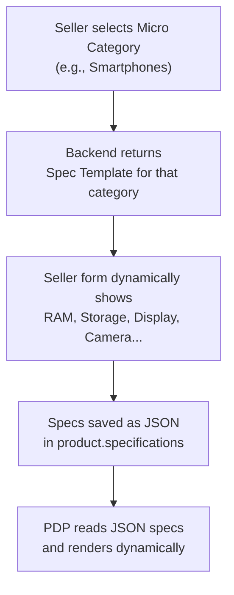
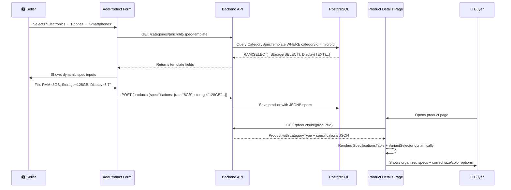

# Dynamic Product Specifications — Amazon/Flipkart-Style Implementation Plan

## Problem Statement

The current PDP templates have **hardcoded** attributes that don't match real product diversity:

| Current Problem | Example |
|---|---|
| FashionView shows `XS, S, M, L, XL, XXL` for everything | Shoes need `6, 7, 8, 9, 10` (UK) — Sarees need **no size at all** |
| ElectronicsView shows generic "Warranty: 1 Year" | Phones need RAM/Storage selectors, Headphones need Driver Size/Impedance |
| No way for sellers to enter category-specific specs | All products get the same generic form |
| Specs table only renders in ElectronicsView | Fashion/Home/Sports have no spec display |

## How Amazon/Flipkart Solve This

They use **Category Attribute Templates (CATs)**:



Each micro category defines **what fields a product needs**, and the PDP renders them contextually.

---

## Architecture: 3 Pillars

### Pillar 1: Category Spec Templates (Backend)

A new `CategorySpecTemplate` entity defines what specification fields each **micro category** requires.

#### [NEW] `CategorySpecTemplate.java`

```java
@Entity
public class CategorySpecTemplate {
    @Id @GeneratedValue
    private Long id;
    
    @ManyToOne
    private Category category;        // Links to MICRO category
    
    private String specKey;           // "ram", "storage", "sole_material"
    private String specLabel;         // "RAM", "Storage", "Sole Material"
    private String specGroup;         // "Performance", "General", "Material"
    private String specType;          // TEXT, NUMBER, SELECT, SIZE_SELECTOR, COLOR_PICKER
    
    @Column(columnDefinition = "jsonb")
    private List<String> options;     // ["4GB","6GB","8GB"] for SELECT type
    
    private Boolean required;
    private Integer displayOrder;
    private Boolean isVariant;        // true = creates buyer-selectable options (size, color)
}
```

#### Example Seed Data

| Category (Micro) | specKey | specLabel | specType | options | isVariant |
|---|---|---|---|---|---|
| **Smartphones** | `ram` | RAM | `SELECT` | `["4GB","6GB","8GB","12GB"]` | ❌ |
| **Smartphones** | `storage` | Storage | `SELECT` | `["64GB","128GB","256GB","512GB"]` | ❌ |
| **Smartphones** | `display_size` | Display Size | `TEXT` | — | ❌ |
| **Smartphones** | `battery` | Battery | `TEXT` | — | ❌ |
| **Smartphones** | `processor` | Processor | `TEXT` | — | ❌ |
| **Smartphones** | `color` | Color | `COLOR_PICKER` | `["Black","Blue","Silver","Gold"]` | ✅ |
| **Headphones** | `driver_size` | Driver Size | `TEXT` | — | ❌ |
| **Headphones** | `connectivity` | Connectivity | `SELECT` | `["Bluetooth","Wired","Both"]` | ❌ |
| **Headphones** | `noise_cancellation` | Noise Cancellation | `SELECT` | `["Active","Passive","None"]` | ❌ |
| **Headphones** | `color` | Color | `COLOR_PICKER` | `["Black","White","Blue"]` | ✅ |
| **Shoes** | `size` | Size (UK) | `SIZE_SELECTOR` | `["6","7","8","9","10","11","12"]` | ✅ |
| **Shoes** | `upper_material` | Upper Material | `SELECT` | `["Leather","Canvas","Mesh","Synthetic"]` | ❌ |
| **Shoes** | `sole_material` | Sole Material | `SELECT` | `["Rubber","EVA","PU","TPR"]` | ❌ |
| **Sarees** | `fabric` | Fabric | `SELECT` | `["Silk","Cotton","Georgette","Chiffon"]` | ❌ |
| **Sarees** | `length` | Length (meters) | `NUMBER` | — | ❌ |
| **Sarees** | `blouse_piece` | Blouse Piece | `SELECT` | `["Included","Not Included"]` | ❌ |
| **Sarees** | `color` | Color | `COLOR_PICKER` | — | ✅ |
| **Shirts** | `size` | Size | `SIZE_SELECTOR` | `["S","M","L","XL","XXL"]` | ✅ |
| **Shirts** | `fit_type` | Fit Type | `SELECT` | `["Regular","Slim","Oversized"]` | ❌ |
| **Shirts** | `sleeve` | Sleeve | `SELECT` | `["Full","Half","Sleeveless"]` | ❌ |
| **Furniture** | `material` | Material | `SELECT` | `["Wood","Metal","Plastic"]` | ❌ |
| **Furniture** | `dimensions` | Dimensions (L×W×H) | `TEXT` | — | ❌ |
| **Furniture** | `assembly` | Assembly Required | `SELECT` | `["Yes","No"]` | ❌ |

#### New API Endpoints

| Method | Endpoint | Purpose |
|---|---|---|
| `GET` | `/api/categories/{categoryId}/spec-template` | Fetch spec fields for a category |
| `POST` | `/api/admin/categories/{categoryId}/spec-template` | Add/manage spec templates (admin) |

---

### Pillar 2: Dynamic Seller Form (Frontend)

#### [MODIFY] [AddProduct.jsx](file:///d:/Ganesh/work/Ecommerce-Web/ecom-frontend/src/pages/seller/AddProduct.jsx)

When the seller selects a micro category → fetch the spec template → render dynamic form fields:

```
Step 1: Select Category         [Electronics] → [Mobile Phones] → [Smartphones]
Step 2: Fill Basic Info          Product Name, Brand, Price...
Step 3: Fill Specifications      ← NEW dynamic section based on template
  ┌──────────────────────────────────────────┐
  │ 📱 Smartphone Specifications             │
  │                                          │
  │ Performance                              │
  │ ┌─ RAM:       [  6GB   ▼]               │
  │ ├─ Storage:   [ 128GB  ▼]               │
  │ └─ Processor: [Snapdragon 8 Gen 2    ]  │
  │                                          │
  │ Display                                  │
  │ ├─ Size:      [6.7 inches            ]  │
  │ └─ Type:      [ AMOLED ▼]               │
  │                                          │
  │ Camera                                   │
  │ ├─ Rear:      [50MP + 12MP + 8MP     ]  │
  │ └─ Front:     [16MP                  ]   │
  │                                          │
  │ Available Colors: ● ● ● ●               │
  └──────────────────────────────────────────┘
Step 4: Upload Images
Step 5: Publish
```

The form renderer maps `specType` to UI components:
- `TEXT` → text input
- `NUMBER` → number input
- `SELECT` → dropdown
- `SIZE_SELECTOR` → chip/button group (with category-specific labels)
- `COLOR_PICKER` → color swatch selector

---

### Pillar 3: Dynamic PDP Rendering (Frontend)

#### [MODIFY] All Category Templates

Instead of hardcoded specs, the PDP reads `product.specifications` dynamically:

**Before (hardcoded):**
```jsx
// FashionView.jsx
const sizes = ["XS", "S", "M", "L", "XL", "XXL"]; // ❌ hardcoded for all fashion
```

**After (data-driven):**
```jsx
// Uses product.specifications.available_sizes from backend
const sizes = product.specifications?.available_sizes || [];
// Shoes → ["6","7","8","9","10"]
// Shirts → ["S","M","L","XL","XXL"]
// Sarees → [] (no size selector rendered)
```

#### Spec Rendering Logic

```
categoryType = "Electronics"
  → Show specs in grouped table (Performance, Display, Camera...)
  → Show warranty/replacement from specs (not hardcoded "1 Year")
  
categoryType = "Fashion"  
  → Show size selector ONLY if specs.available_sizes exists
  → Show color selector ONLY if specs.available_colors exists
  → Show fabric/material details from specs
  
categoryType = "Home & Living"
  → Show dimensions from specs
  → Show material/assembly info
  
categoryType = "Sports & Fitness"
  → Show weight capacity, material from specs
```

#### [NEW] `SpecificationsTable.jsx` (Shared component)

A unified component that renders any product's specifications in organized groups:

```jsx
<SpecificationsTable 
    specifications={product.specifications} 
    categoryType={product.categoryType} 
/>
// Automatically groups and renders specs in a clean table
```

#### [NEW] `VariantSelector.jsx` (Shared component)

A smart component that renders size/color selection based on what's available:

```jsx
<VariantSelector 
    specifications={product.specifications}
    categoryName={product.categoryName}  // "Shoes" vs "Shirts" vs "Sarees"
/>
// Renders shoe sizes as "UK 6, 7, 8..." 
// Renders shirt sizes as "S, M, L..."
// Renders nothing for sarees
// Renders color swatches if available_colors exists
```

---

## Proposed Changes Summary

### Backend

| Action | File | Change |
|---|---|---|
| [NEW] | `CategorySpecTemplate.java` | Entity with specKey, type, options, group |
| [NEW] | `CategorySpecTemplateRepository.java` | JPA repository |
| [NEW] | `CategorySpecTemplateService.java` | Business logic for fetching templates |
| [NEW] | `CategorySpecTemplateController.java` | REST endpoints |
| [NEW] | `data.sql` / migration | Seed spec templates for each micro category |

### Frontend — Seller Side

| Action | File | Change |
|---|---|---|
| [MODIFY] | [AddProduct.jsx](file:///d:/Ganesh/work/Ecommerce-Web/ecom-frontend/src/pages/seller/AddProduct.jsx) | Add dynamic "Specifications" section after category selection |
| [NEW] | `DynamicSpecForm.jsx` | Renders form fields based on spec template |

### Frontend — PDP

| Action | File | Change |
|---|---|---|
| [NEW] | `product-shared/SpecificationsTable.jsx` | Universal grouped spec display |
| [NEW] | `product-shared/VariantSelector.jsx` | Smart size/color selector based on specs data |
| [MODIFY] | [ElectronicsView.jsx](file:///d:/Ganesh/work/Ecommerce-Web/ecom-frontend/src/components/product-templates/ElectronicsView.jsx) | Remove hardcoded specs, use `SpecificationsTable` |
| [MODIFY] | [FashionView.jsx](file:///d:/Ganesh/work/Ecommerce-Web/ecom-frontend/src/components/product-templates/FashionView.jsx) | Remove hardcoded sizes, use `VariantSelector` + `SpecificationsTable` |
| [MODIFY] | [HomeLivingView.jsx](file:///d:/Ganesh/work/Ecommerce-Web/ecom-frontend/src/components/product-templates/HomeLivingView.jsx) | Add `SpecificationsTable` for dimensions/materials |
| [MODIFY] | [SportsFitnessView.jsx](file:///d:/Ganesh/work/Ecommerce-Web/ecom-frontend/src/components/product-templates/SportsFitnessView.jsx) | Remove hardcoded specs, use `SpecificationsTable` |

---

## Data Flow (End-to-End)



---

## Verification Plan

### Automated
- Backend build: `mvnw clean install -DskipTests`
- Frontend build: `npm run build`
- Seed data verification: Check spec templates load for each micro category

### Manual Testing
1. **Seller Flow**: Create products in different micro categories, verify dynamic form fields appear correctly
2. **PDP - Electronics**: Verify smartphone shows RAM/Storage/Camera, headphones show Driver Size/Impedance
3. **PDP - Fashion**: Verify shoes show UK sizes, shirts show S/M/L, sarees show no size selector
4. **PDP - Home**: Verify furniture shows dimensions and assembly info
5. **PDP - Sports**: Verify equipment shows weight capacity and material

> [!IMPORTANT]
> **Phase 2 (Future)**: Full variant system with per-variant pricing, stock, and images (e.g., iPhone 128GB costs ₹79,999 vs 256GB costs ₹89,999). This plan focuses on Phase 1: getting the right spec fields and selectors for each product type.
